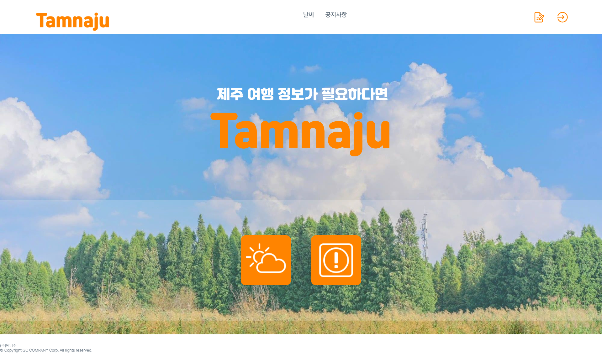
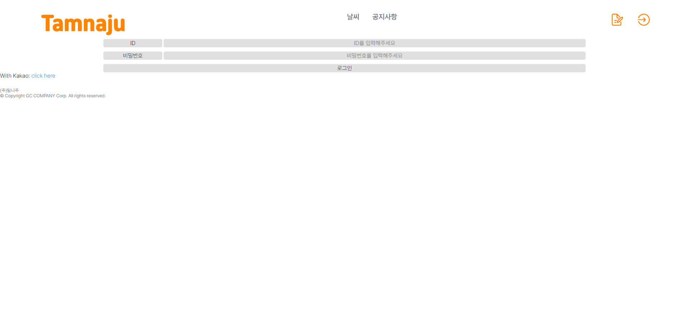
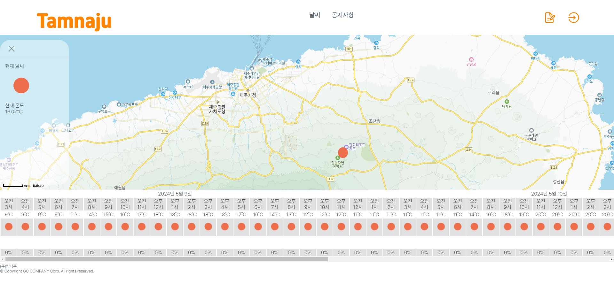
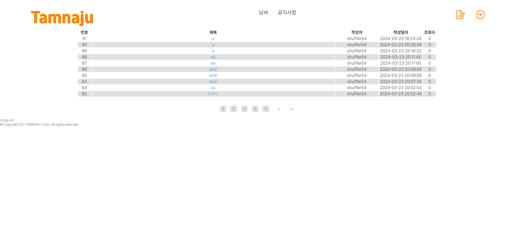
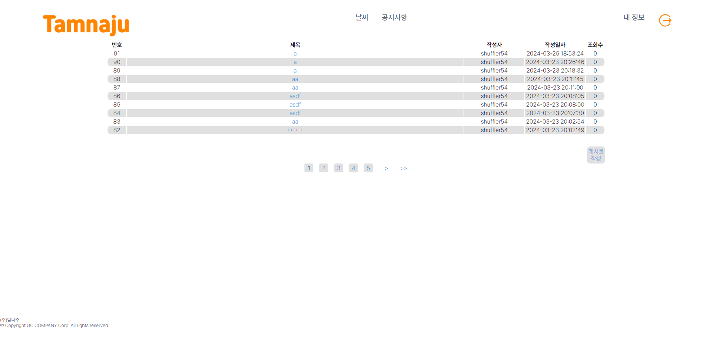

# 탐나주 프로젝트

## 역할

- 김성민 : 날씨 페이지 구현 및 API 연동
- 김태현 : 공지사항 페이지 및 백엔드 구현

## 기술

- IDE : vscode, intellij
- 언어 : JAVA
- 프레임워크 : Spring Boot
  - 의존성 : gradle, mybatis, thymeleaf
- DB : mariadb

## 기능

- 날씨정보
- ~~숙박정보~~
- ~~렌트정보~~
- 공지사항

## 상세

> 회원가입 아이콘은 우측 상단에, 로그인하지 않은 상태에서 활성화된다.

> 로그인 페이지에는 로컬 계정을 통한 로그인할 수 있으며, 카카오 계정을 통해 Oauth2 유저로 가입 및 로그인도 가능하다.

> 로그인에 성공하면 메인 페이지로 이동하게 되며, 우측 상단의 버튼이 교체된다.

> 날씨 페이지에서 지도상 임의의 위치를 클릭하면, 해당 지점의 기상정보를 확인할 수 있으며, 해당일자로부터 3일간의 예보를 확인할 수 있다.

> 공지사항을 작성, 조회, 수정할 수 있다. 단, 비회원이나 권한이 없는 회원은 조회만 가능하다.

> 권한이 있는 계정으로 로그인 시, 작성할 수 있는 버튼이 활성화 된다.
